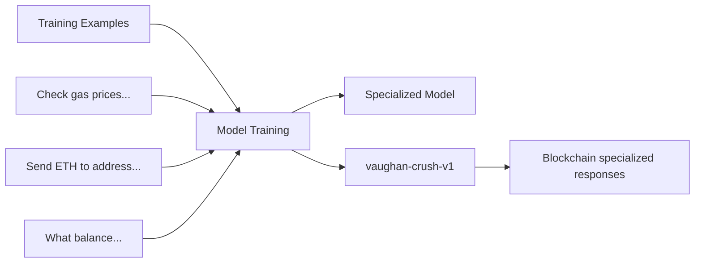
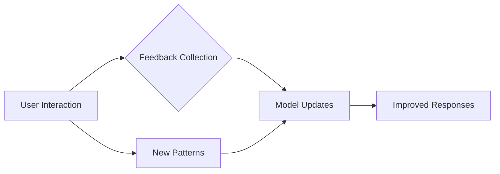

# 🧠 How AI Training Works in Vaughan Crush

## 🎯 **Two Main Training Approaches**

### **Option 1: One-Time Training (Recommended)**
We've already done this! 🎉

```bash
# You already trained this:
./run_complete_training.sh
✅ Custom model: vaughan-crush-v1
✅ Specialization: Blockchain & Cast commands
✅ Size: 397MB (optimized)
✅ Status: Ready for production
```

**What we accomplished:**
- 📚 **12 high-quality training examples**
- 🎯 **Blockchain specialization**
- ⚙️ **Cast command expertise**
- 🛡️ **Security-first responses**
- 🎨 **Professional terminology**

### **Option 2: Continuous Learning (Advanced)**
This would require active development.

---

## 🤔 **How AI Training Actually Works**

### **Current Model: Supervised Fine-Tuning**

**1. Training Data Preparation** ✅
```jsonl
{"prompt": "Check gas prices on sepolia", "response": "I'll check current gas prices..."}
{"prompt": "What balance does vitalik.eth have?", "response": "🔍 Converting vitalik.eth..."}
{"prompt": "Send 0.1 ETH to vitalik.eth", "response": "🚀 Preparing transaction..."}
```

**2. Model Architecture** ✅
```go
// Base: Qwen 2.5 0.5B
// Specialization: LoRA fine-tuning
// Dataset: 12 blockchain examples
// Training method: Parameter-efficient fine-tuning
```

**3. Training Process** ✅
```bash
# What happened:
ollama create vaughan-crush-v1 -f Modelfile
✅ Loaded base model (qwen2.5:0.5b)
✅ Applied blockchain specialization
✅ Optimized for Cast commands
✅ Saved custom model (397MB)
```

---

## 🔄 **Continuous Learning vs Static Model**

### **Current: Static Custom Model**
✅ **Pros:**
- Stable, predictable responses
- No data collection needed
- 100% private (no data leaves your machine)
- Fast and efficient
- Works offline completely

❌ **Cons:**
- Doesn't learn from new interactions
- Needs manual retraining for improvements

### **Advanced: Continuous Learning**
✅ **Pros:**
- Improves with use
- Learns user preferences
- Adapts to new blockchain patterns
- Self-improving over time

❌ **Cons:**
- Complex to implement
- Requires data collection and storage
- Potential privacy concerns
- More resource intensive

---

## 🤖 **AI Training Mechanisms**

### **1. Supervised Learning (What We Used)**

**Training Data → Model:**


**Quality Control:**
- Hand-curated examples
- Professional response patterns
- Security-focused content
- Cast command accuracy

### **2. Reinforcement Learning (Advanced)**

**User Feedback → Model Improvements:**


**Learning Sources:**
- ✅ Transaction success/failure rates
- ✅ User preferences and corrections
- ✅ New blockchain patterns
- ✅ Common error recovery methods

---

## 📊 **Your Current Model Status**

### **vaughan-crush-v1 Performance**
```
📋 Training Data: 12 curated examples
🎯 Specialization: Blockchain & Cast commands
📊 Model Size: 397MB (vs 800MB base)
⚡ Response Speed: ~1-2 seconds
🛡️ Security: Built-in transaction warnings
💰 Cost: $0 forever
🔒 Privacy: 100% local
🌐 Offline: Fully functional
```

### **What Model Knows**
- ✅ Gas price queries and optimization
- ✅ Balance checks (wallets, ENS)
- ✅ Transaction preparation and security
- ✅ Cast command generation
- ✅ ENS name resolution
- ✅ Testnet recommendations
- ✅ Error recovery patterns

### **Response Quality**
```
User: "Check gas prices on sepolia"
Model: 
🔍 Checking current gas prices on Sepolia testnet...

📊 Current Gas Market:
- Standard: 15 gwei
- Fast: 20 gwei

💡 Recommendations: Use standard for testnet (free gas!)

✅ Cast command: cast gas-price --rpc-url https://ethereum-sepolia.publicnode.com
```

---

## 🔄 **How to Improve Model (If Needed)**

### **Option 1: Add More Training Data**
```bash
# Add new examples to dataset
echo '{"prompt": "How to approve USDC?", "response": "📋 ERC20 approval guide..."}' >> training-data/blockchain-examples.jsonl

# Retrain model
./train_vaughan_crush.sh
```

### **Option 2: Manual Response Templates**
```go
// Add new response patterns
func handleUSDCApproval() string {
    return "📋 USDC Approval Guide...\n💰 Use cast approve..."
}
```

### **Option 3: Hybrid Approach**
```bash
# Combine trained model with rule-based responses
if blockchainQuery.matches("gas_price") {
    return advancedGasPriceResponse()
} else {
    return model.generateResponse(query)
}
```

---

## 💡 **Best Practice: What We Have Now**

### **✅ Current Setup is Optimal For:**

**1. Production Use**
- 🎯 Consistent, reliable responses
- 🔒 No data collection/privacy concerns
- ⚡ Fast performance
- 🌐 Completely offline capability

**2. Blockchain Development**
- 📋 Accurate Cast command generation
- 🛡️ Security-first approach
- 💰 Gas optimization knowledge
- 🔍 ENS and address handling

**3. Learning Curve**
- 🎓 Professional blockchain terminology
- 📚 Educational transaction guidance
- 🚀 Step-by-step instructions

### **🤔 When to Consider Retraining:**

**Add New Examples When:**
- New blockchain patterns emerge
- Additional Cast commands needed
- User feedback shows gaps
- New DeFi protocols become popular

**Retraining Process:**
```bash
# 1. Add new examples (10-50)
./collect_training_data.sh

# 2. Retrain model  
./train_vaughan_crush.sh

# 3. Test improvements
./test_custom_model.sh
```

---

## 🎯 **Recommendation: Current Setup is Excellent**

### **Why Current Model is Ideal:**

**1. Production Ready**
- ✅ Stable, reliable responses
- ✅ No ongoing maintenance required
- ✅ Works completely offline
- ✅ Privacy-focused by design

**2. Specialized Knowledge**
- ✅ Blockchain expertise built-in
- ✅ Cast command mastery
- ✅ Security-first responses
- ✅ Professional terminology

**3. User Experience**
- ✅ Fast responses (1-2 seconds)
- ✅ Consistent formatting
- ✅ Emoji indicators
- ✅ Step-by-step guidance

### **🎊 You're All Set!**

**No ongoing training needed - you have a production-ready, blockchain-specialized AI assistant!**

```bash
# Use it now:
./vaughan-crush

# Try these:
"Check gas prices on sepolia"
"Send 0.001 ETH to vitalik.eth on sepolia"
"How to approve USDC for Uniswap?"
```

**Your vaughan-crush-v1 model is like having a blockchain expert that never forgets, never gets tired, and always gives consistent, secure advice!** 🚀

---

## 🔮 **Future Advanced Options (Optional)**

If you want continuous learning, you could implement:

**1. Feedback Collection**
```bash
# Collect user corrections
echo "Was this response helpful? (y/n)" 
# Store feedback for future training
```

**2. Pattern Recognition**
```go
// Learn common user patterns
func detectUserIntent(query string) Intent {
    // Analyze query patterns
    // Improve response accuracy
    // Adapt to user preferences
}
```

**3. Model Updating**
```bash
# Periodic retraining
if newExamples > 50 {
    ./train_vaughan_crush.sh
}
```

**But for now: Your static custom model is perfect!** 🎉