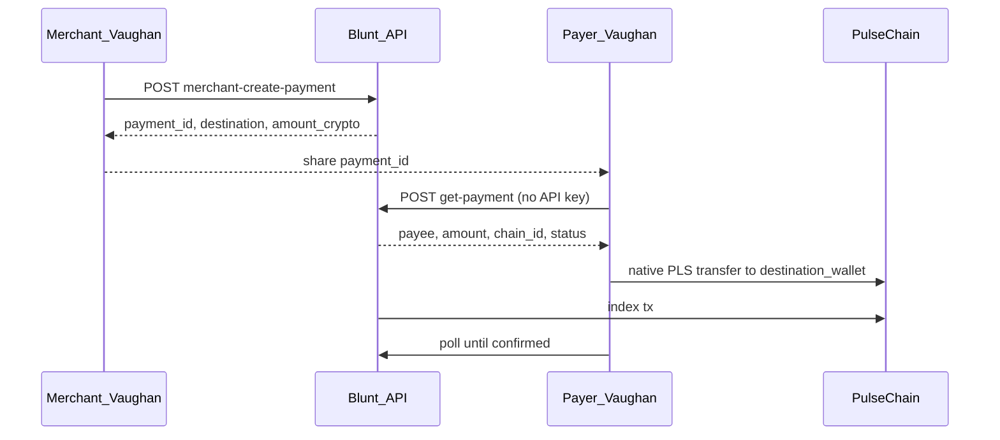

# Blunt → Browserless Pulse integration (parked)

> **Status: PARKED** (2026-08-27). Resume when a Blunt merchant API key is available.
> Prototype folder: `/home/r4/Desktop/Blunt-vaughan` (Desktop, outside repo).
> Official API: [blunt.cash/merchant/docs/reference/api](https://blunt.cash/merchant/docs/reference/api).
> **v1 scope: direct wallet pay, no VaughanPaymentRouter, no protocol fees.**

## Why this fits Browserless Pulse

Blunt is API + direct-to-wallet settlement — no checkout website in Vaughan. Matches
[browserless-pulse.md](browserless-pulse.md): invoice create / pay / confirm as terminal verbs.



## v1 in scope vs deferred

| In v1 | Deferred |
|-------|----------|
| `vaughan-core::core::blunt` HTTP client (official API) | `VaughanPaymentRouter.sol` + fee BPS |
| Encrypted API key (Piteas pattern) | Pay-with-any-token (DEX first) |
| Direct transfer to `destination_wallet` | MCP propose tools |
| CLI: `blunt configure`, `invoice`, `pay`, `status` | Full POS tab, ASCII QR |
| TUI: Send pay-invoice + Receive create-invoice sub-modes | Webhooks server in Vaughan |
| Mock HTTP tests (CI without live key) | |

## API facts (verified from public docs)

| Topic | Value |
|-------|-------|
| Create payment | `POST https://blunt.cash/functions/v1/merchant-create-payment` |
| Get status | `POST https://blunt.cash/functions/v1/get-payment` — **no API key** (payer-friendly) |
| PulseChain | `chain_id: "pls"`, token `pls` only (native PLS) |
| **Not** the prototype | Desktop `blunt.rs` uses wrong host `api.blunt.cash/v1` |
| Testnet | Blunt has **no test mode** — mainnet PLS only for live proof |
| Wallet gate | Payout address must be registered in dashboard before create |

## Phase 0 — Get API key (prerequisite)

1. [blunt.cash/merchant/auth](https://blunt.cash/merchant/auth) → create account (Secret Key + PIN; **save Secret Key**).
2. Dashboard → **Wallets** → register PulseChain address.
3. Dashboard → **API Keys** → copy secret key (`sk_live_…` style).
4. Smoke-test with curl (see Cursor plan or TASKS.md).
5. Stuck? [support@blunt.cash](mailto:support@blunt.cash) or [Telegram @blunt.cash](https://t.me/blunt.cash).

## Implementation phases (when resumed)

### Phase 1 — `vaughan-core/src/core/blunt/`

- `client.rs` — `merchant-create-payment`, `get-payment`, `poll_until_confirmed`
- `types.rs` — request/response structs, status enum
- `config.rs` — `blunt.toml` + encrypted `blunt.key.json`; env `BLUNT_API_KEY`
- `chain_map.rs` — `pls` ↔ Vaughan `pulsechain` (369)
- `resolve_payment_for_pay()` → recipient, amount, network for existing send path

Pattern refs: [`vaughan-core/src/core/bridge/client.rs`](../vaughan-core/src/core/bridge/client.rs),
[`vaughan-core/src/core/piteas/config.rs`](../vaughan-core/src/core/piteas/config.rs).

### Phase 2 — Pay orchestrator

Reuse existing sign/broadcast + approve gate — no new signing logic. Native PLS only on `pls`.

### Phase 3 — CLI

```bash
vaughan blunt configure
vaughan blunt invoice --amount-usd 10 --reference "order-42" --chain pls
vaughan blunt pay <payment_id> [--wait] [--yes] [--json]
vaughan blunt status <payment_id>
```

### Phase 4 — TUI

Extend Send (`b`) with “Pay Blunt invoice”; Receive (`v`) with “Create invoice”; Settings for API key.

### Phase 5 — Tests + requirements

- Mock HTTP tests in `vaughan-core/tests/blunt_client.rs`
- Add FR-8.* to REQUIREMENTS.md; update browserless-pulse demo script

## Risks

1. Desktop prototype is stale — implement against official REST API only.
2. No Blunt testnet — CI mocks + optional tiny mainnet smoke with `--yes`.
3. Quote expiry — volatile assets quote ~10 min; payer must send exact `amount_crypto`.
4. Full Blunt-vaughan PLAN.md overshoots (MCP, router, DEX) — ignore until v1 proven.

## Resume checklist

- [ ] Phase 0 complete (API key + curl smoke test)
- [ ] Say “execute blunt plan” or “implement blunt integration” in Cursor
- [ ] Start with Phase 1 core client + mocks, then CLI pay path
